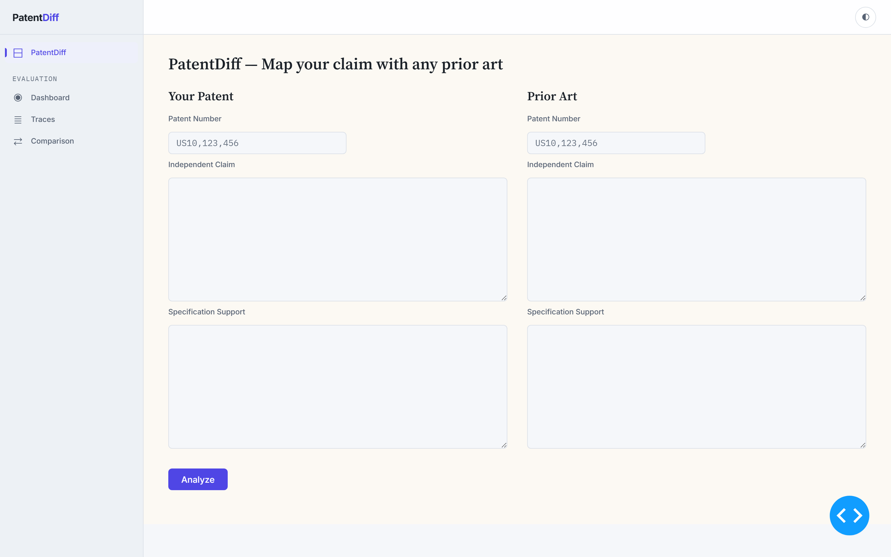
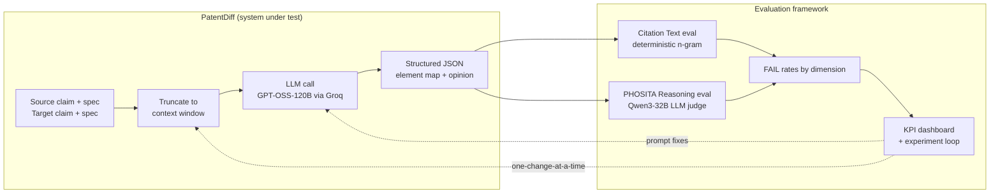
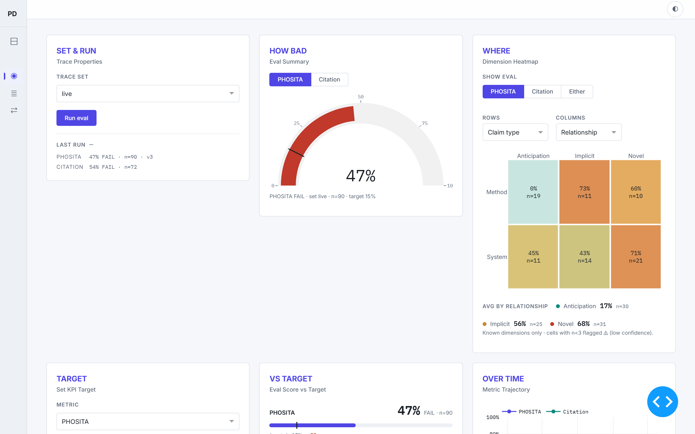
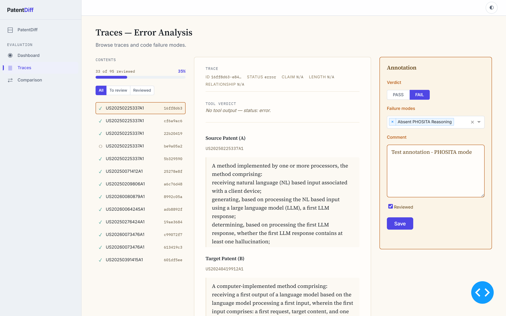
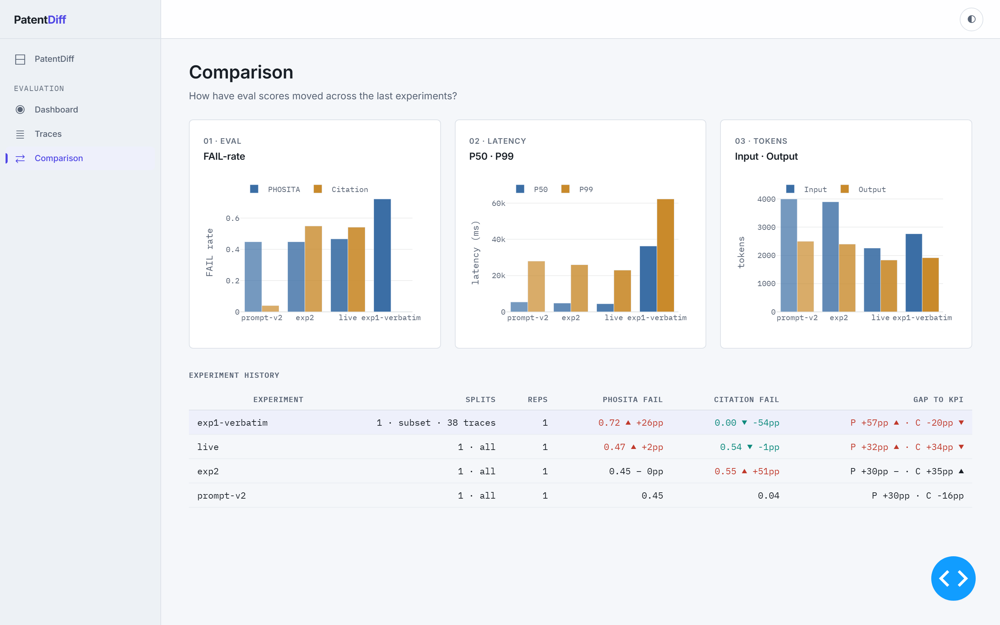
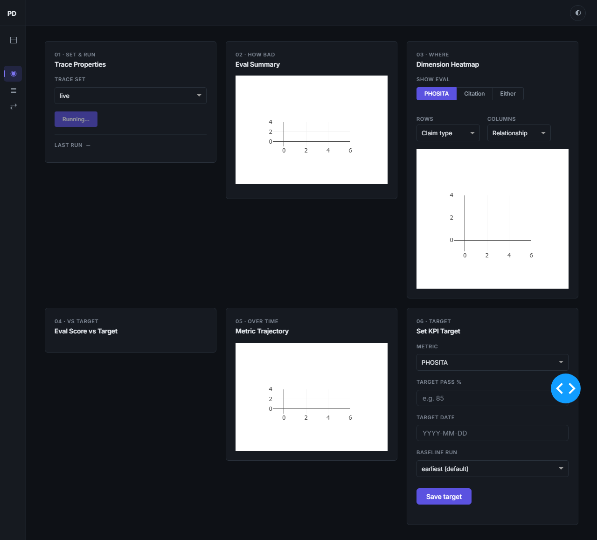

<div align="center">

# 🔍 PatentDiff

### From raw LLM traces to product KPIs — an end-to-end evaluation framework for LLM-based patent novelty analysis

[](https://www.python.org/)
[](https://dash.plotly.com/)
[](#-testing)
[](#-the-evaluation-methodology)
[](#-disclaimer)

*Turn a working LLM product into a measurable, improvable one — by discovering how it fails, scoring those failures automatically, and tracking them as KPIs a product manager can own.*



</div>

---

## 📑 Table of Contents

- [What is PatentDiff?](#-what-is-patentdiff)
- [Why this exists](#-why-this-exists)
- [How it works](#-how-it-works)
- [The evaluation methodology](#-the-evaluation-methodology)
- [The workbench](#-the-workbench)
- [Results](#-results)
- [Quickstart](#-quickstart)
- [Usage](#-usage)
- [Project structure](#-project-structure)
- [Tech stack](#-tech-stack)
- [Testing](#-testing)
- [Disclaimer](#-disclaimer)

---

## 🧭 What is PatentDiff?

**PatentDiff** is a patent-comparison tool that analyses the **novelty** of a patent claim. Given a *source* patent's independent claim and a *target* prior-art patent (claim + specification), it:

1. Maps each **claim element** of the source to corresponding text in the prior art,
2. Gives a **per-element novelty opinion**, and
3. Produces an **overall opinion** on whether the source claim is valid over the prior art.

It is built for two user segments who do element-level claim-to-prior-art comparison every day: **patent prosecutors** responding to USPTO office actions, and **in-house IP teams** doing patentability / freedom-to-operate analysis.

> [!IMPORTANT]
> PatentDiff is a **research prototype** built specifically to have a *real, breaking LLM product* against which a systematic evaluation framework could be developed. The product is the test bed — **the evaluation framework is the project.**

---

## 💡 Why this exists

LLM products fail **silently**. A single "accuracy" number hides both *where* the product breaks and *whether* a fix actually moved the needle — and in patent work, a wrong answer is expensive.

This repo answers the one question a PM running a deployed LLM product needs answered:

> ### 🎯 *"Where is my product breaking, how badly, and is my change actually moving the metric?"*

| The problem | The eval framework's answer |
|---|---|
| Aggregate accuracy isn't actionable | A **measurable KPI per failure mode** the PM can set a ceiling on |
| You can't tell *where* it fails | A **dimension-level heatmap** (claim type × relationship × length) |
| You can't prove a fix worked | A **before/after experiment loop** with a regression gate |
| Expert review doesn't scale | **Automated evaluators** validated against expert labels (TPR/TNR) |

---

## ⚙️ How it works

PatentDiff itself is a **single LLM call**. The eval framework wraps a diagnostic loop *around* that call.



**The two failure modes** the framework measures (distilled from expert annotation):

| Failure mode | What it catches | Evaluator |
|---|---|---|
| 🧾 **Citation Text** | The tool *paraphrases* prior-art text instead of **quoting it verbatim**, so the user can't verify the mapping | Deterministic code (n-gram containment) |
| 🧠 **Absent PHOSITA Reasoning** | The tool declares an element non-obvious **without explaining why** a Person Having Ordinary Skill In The Art would agree (35 U.S.C. § 103) | LLM judge (Qwen3-32B) |

---

## 🔬 The evaluation methodology

The framework follows **Hamel Husain's critique-shadowing** methodology — a product diagnostic applied to a working product:

1. **Dataset coverage analysis** — map real traces into a **2 × 3 × 2** matrix (claim type × disclosure relationship × claim length) so failures localize to contexts that matter.
2. **Synthetic data generation** — fill the empty cells of the matrix with realistic, expert-reviewed claim pairs.
3. **Open coding** — a domain expert reviews every trace and writes free-form critiques of what's wrong.
4. **Axial coding** — cluster ~18 raw labels into a small set of failure modes grounded in shared root causes.
5. **Layered eval architecture** — pick the cheapest evaluator that catches each mode (deterministic code → LLM judge).
6. **Judge alignment** — validate every evaluator against a **30-trace human golden set** (True/False Positive Rates).

📂 The full design specs and plans for each step live in [`docs/superpowers/`](docs/superpowers/); experiment write-ups live in [`docs/eval-experiments/`](docs/eval-experiments/).

---

## 🖥️ The workbench

A single Dash app (`app_unified`) hosts the prototype **and** the full evaluation workbench across four tabs.

### `Dashboard` — the diagnostic console
*Headline FAIL rates → dimension heatmap → KPI targets → priority (frequency × user impact) → decision.*



### `Traces` — expert annotation
*Read the source claim, prior art, and PatentDiff output; tag failure modes; record PASS/FAIL critiques that become the golden set.*



### `Comparison` — the experiment tracker
*Before/after PASS rates, the verdict-transition matrix, and flipped traces (fixed vs. regressed) for one-change-at-a-time experiments.*



> 💡 The whole app supports light & dark themes.
> 

---

## 📊 Results

The framework was validated end-to-end on an **87-trace corpus** (50 real prosecution cases + 33 synthetic) against a 30-trace human golden set.

**Evaluator ↔ human alignment (golden set):**

| Evaluator | TPR (sensitivity) | TNR (specificity) | Notes |
|---|---|---|---|
| Citation Text (code) | **100%** | 64% | Conservative by design — trades precision for recall |
| PHOSITA Reasoning (judge) | **78%** | 60% | Reached after **3** prompt iterations + 4 few-shot examples |

**Experiment 1 — verbatim-quote prompt fix (one change, measured on a 38-trace subset):**

| Eval | Role | Before FAIL | After FAIL | Δ |
|---|---|---|---|---|
| **Citation** | Target | 41.4% | **0.0%** | **−41.4 pp** ✅ |
| **PHOSITA** | Guardrail | 53.1% | 53.1% | 0 (untouched) |

→ 5 FAIL→PASS, 7 FAIL→NO_CITATIONS (honest empty quotes), **0 regressions** — validating the *trace → failure mode → eval → KPI → experiment* loop end-to-end.

---

## 🚀 Quickstart

> Requires **Python 3.13** and a [Groq](https://groq.com/) API key (the model under test, GPT-OSS-120B, and the Qwen3-32B judge both run on Groq).

```bash
# 1. Clone
git clone <your-fork-url> patentdiff && cd patentdiff

# 2. Install dependencies
pip install -r requirements.txt

# 3. Configure your API key
echo "GROQ_API_KEY=your_key_here" > .env

# 4. Launch the workbench
python -m app_unified.app
```

Then open **http://127.0.0.1:8050/** — the PatentDiff prototype is at `/`, and the evaluation workbench is under `/eval`.

---

## 📖 Usage

### Run the app

```bash
python -m app_unified.app          # prototype + workbench (port 8050)
```

| Route | Page |
|---|---|
| `/` | PatentDiff claim-analysis prototype |
| `/eval` | Dashboard — diagnostic console + KPI targets |
| `/eval/traces` | Traces — expert annotation |
| `/eval/comparison` | Comparison — experiment tracker |

### Run the evaluation pipeline (headless)

```bash
# Score every trace with the deterministic citation eval
python scripts/run_citation_eval.py

# Score every trace with the PHOSITA LLM judge
python scripts/run_phosita_eval.py

# Check judge ↔ human alignment against the golden set
python scripts/run_eval_vs_human.py
python scripts/run_phosita_vs_human.py
```

### Run an experiment (one change at a time)

```bash
# 1. Edit exactly one layer (a prompt block or one pre-processing fn), then regenerate
python scripts/regenerate_traces.py --out traces/traces.exp1.jsonl

# 2. Re-run both evals, then check the before/after success gate
python scripts/check_experiment_gate.py --baseline live --after exp1-verbatim
```

---

## 🗂️ Project structure

```
patentdiff/
├── core/                 # Evaluation engine (the heart of the project)
│   ├── citation_eval.py      # Deterministic n-gram citation evaluator
│   ├── phosita_eval.py       # Qwen3-32B LLM-judge evaluator
│   ├── llm.py                # Groq client + truncation
│   ├── annotation.py         # Golden-set annotation models & storage
│   ├── priority.py           # Frequency × impact prioritisation
│   ├── experiments.py        # Experiment manifest + before/after deltas
│   └── ...                   # kpi_targets, eval_history, dimension_tagger, …
├── app_unified/          # Dash app: prototype + 4-tab eval workbench
├── app_workbench/        # Console body reused by app_unified (shared module)
├── tracing/              # Lightweight trace logging / store
├── scripts/              # Headless eval, regeneration & gate-check CLIs
├── tests/                # 237 tests
├── traces/               # Trace corpus, eval outputs & experiment manifest
├── docs/
│   ├── superpowers/          # Design specs & implementation plans (per step)
│   ├── eval-experiments/     # Experiment write-ups (baseline, exp1)
│   └── assets/               # README screenshots
├── .design/              # Design-skill briefs, reviews & UI screenshots
└── failure_taxonomy.json # The settled failure-mode taxonomy
```

---

## 🧱 Tech stack

- **App / UI** — [Dash](https://dash.plotly.com/) 2.18 (multi-page) + diskcache background callbacks
- **Models** — GPT-OSS-120B (system under test) & Qwen3-32B (judge), both via the **Groq** API
- **Validation** — [Pydantic](https://docs.pydantic.dev/) 2
- **Data** — pandas, openpyxl, JSONL trace store
- **Charts** — Plotly / matplotlib
- **Tests** — pytest

---

## 🧪 Testing

```bash
python -m pytest -q
```

```
237 passed
```

---

## ⚠️ Disclaimer

PatentDiff is a **research prototype**. It is not shipped, not commercially available, and **not legal advice**. Its outputs must not be relied upon for any patent prosecution, validity, or freedom-to-operate decision. The project exists to demonstrate a reusable evaluation methodology for LLM products.

---

<div align="center">

*Built around the question every AI PM should be able to answer: **where is my product breaking, and is my fix working?***

</div>
