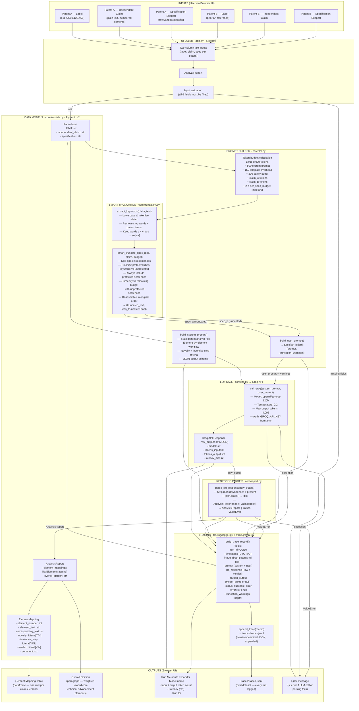

# PatentDiff — System Architecture Diagram

## Overview

PatentDiff is a local Streamlit application that assesses whether a source patent's independent claim is valid against a target patent as prior art. It makes a single LLM call per analysis and logs every run to a JSONL trace file for evaluation.

---

## Architecture Flowchart



---

## Block Reference

| Block | File | Responsibility |
|-------|------|----------------|
| **PatentInput** | `core/models.py` | Pydantic model — validates and holds one patent's label, claim, and spec |
| **AnalysisReport** | `core/models.py` | Pydantic model — holds the full LLM analysis result |
| **ElementMapping** | `core/models.py` | Pydantic model — one row of the element-level analysis |
| **build_system_prompt()** | `core/llm.py` | Builds the static patent analyst system prompt with workflow and JSON schema |
| **Token budget calculation** | `core/llm.py` | Computes per-spec token budget from the 8,000-token Groq limit minus fixed overheads and claim sizes |
| **extract_keywords()** | `core/truncation.py` | Extracts technical terms from a claim by stripping stop words and short words |
| **smart_truncate_spec()** | `core/truncation.py` | Keyword-protected sentence-level truncation — always keeps sentences containing claim keywords, greedily fills remaining budget with other sentences |
| **build_user_prompt()** | `core/llm.py` | Combines truncated specs + claims into the LLM user prompt; returns `(prompt, truncation_warnings)` |
| **call_groq()** | `core/llm.py` | Calls the Groq API (openai/gpt-oss-120b) and returns raw output + usage metrics |
| **parse_llm_response()** | `core/report.py` | Strips markdown fences, JSON-decodes, and Pydantic-validates the LLM output into an AnalysisReport |
| **build_trace_record()** | `tracing/logger.py` | Assembles the full JSONL record for every run (inputs, prompts, LLM response, parsed output, status, warnings) |
| **append_trace()** | `tracing/store.py` | Appends one JSON record to `traces/traces.jsonl` (UTF-8, newline-delimited) |

---

## Data Shapes

### PatentInput (input to pipeline)
```
label:              str   — human-readable patent identifier
independent_claim:  str   — full text of the independent claim
specification:      str   — relevant specification paragraphs
```

### build_user_prompt() output
```
prompt:               str        — formatted markdown string for LLM user message
truncation_warnings:  list[str]  — ["Patent A specification truncated"] and/or
                                   ["Patent B specification truncated"], or []
```

### Groq API response dict
```
raw_output:      str  — raw LLM text (JSON or markdown-fenced JSON)
model:           str  — model name used
tokens_input:    int  — prompt tokens consumed
tokens_output:   int  — completion tokens generated
latency_ms:      int  — round-trip time in milliseconds
```

### ElementMapping (per claim element)
```
element_number:     int          — sequential element index
element_text:       str          — exact claim element text from Patent A
corresponding_text: str          — matching text found in Patent B (or "")
novelty:            "Y" | "N"   — Y = not novel (found in prior art)
inventive_step:     "Y" | "N"   — Y = obvious given prior art
verdict:            "Y" | "N"   — Y = prior art anticipates this element
comment:            str          — step-by-step reasoning
```

### Trace record (written to traces/traces.jsonl)
```
run_id:               str        — UUID v4
timestamp:            str        — UTC ISO 8601
inputs:               dict       — both patents (label, claim, spec)
prompt:               dict       — system_prompt + user_prompt
llm_response:         dict       — raw_output, model, tokens, latency
parsed_output:        dict|null  — AnalysisReport.model_dump() or null on error
status:               str        — "success" | "error"
error:                str|null   — exception message or null
truncation_warnings:  list[str]  — which specs were truncated ([] if none)
```

---

## Token Budget Logic

```
GROQ_TOKEN_LIMIT        = 8,000
− SYSTEM_PROMPT_TOKENS  =   500  (conservative estimate for system prompt)
− TEMPLATE_OVERHEAD     =   150  (markdown labels and separators)
− SAFETY_BUFFER         =   300  (headroom for estimation error)
− claim_A_tokens             (actual claim A word count × 1.3)
− claim_B_tokens             (actual claim B word count × 1.3)
─────────────────────────────
= available_tokens

per_spec_budget = max(available_tokens // 2, 500)
```

Token estimation: `int(len(text.split()) * 1.3)` — word count × 1.3 approximates subword tokenisation without an external library.

---

## Error Paths

| Failure point | Behaviour |
|---------------|-----------|
| Missing UI fields | `st.error()` shown, analysis does not start |
| `GROQ_API_KEY` not set | `ValueError` raised before API call, caught by except block |
| Groq API error (e.g. 413, 401, network) | Exception caught, error trace logged, `st.error()` shown |
| LLM returns invalid JSON | `parse_llm_response()` raises `ValueError`, error trace logged, `st.error()` shown |
| LLM returns JSON that fails schema validation | `parse_llm_response()` raises `ValueError`, same path as above |

In every error case a trace record with `status: "error"` and `error: "<message>"` is still appended to `traces/traces.jsonl`.
